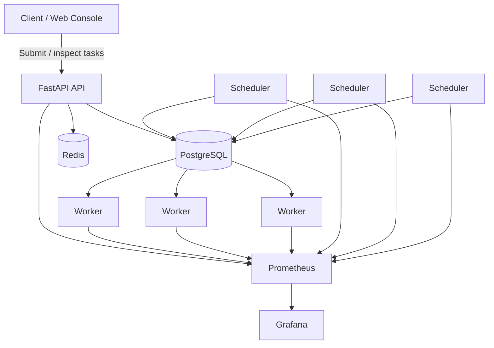
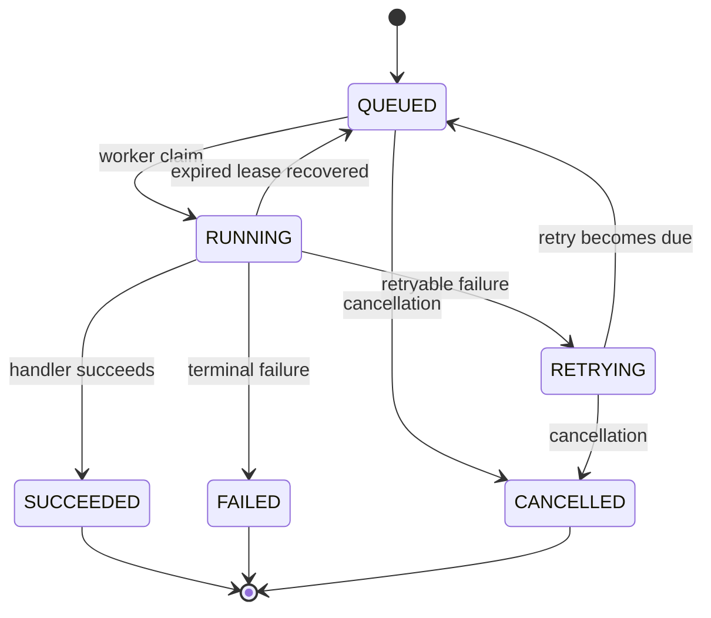

# TaskForge

> A fault-tolerant distributed task execution and scheduling platform built with Go, Python, PostgreSQL, Redis, Docker, Prometheus, and Grafana.

TaskForge is a distributed task orchestration system designed to explore the engineering problems behind reliable background execution: concurrent worker coordination, durable task state, retries, worker failure, leases, recovery, idempotent submission, and observability.

Rather than relying on an in-memory queue for ownership, TaskForge uses PostgreSQL as the durable source of truth. Workers atomically compete for work using `FOR UPDATE SKIP LOCKED`, execute tasks under renewable leases, and persist a complete attempt history. Scheduler replicas independently promote retries and recover work from expired leases without requiring leader election.

The system has been validated under multi-worker contention, retry storms, hard worker crashes, API submission load, and multiple workload profiles using a reproducible benchmark framework that records immutable timing evidence and reconciles PostgreSQL state against Prometheus metrics.

---

## Highlights

- **Atomic distributed task claiming** with PostgreSQL `FOR UPDATE SKIP LOCKED`
- **Priority-aware scheduling** with deterministic FIFO tie-breaking
- **Concurrent workers** without duplicate task claims
- **Worker heartbeats** and database-derived liveness states
- **Renewable task leases** with stale-owner protection
- **Crash recovery** for work abandoned by dead workers
- **Retryable vs terminal failures** with bounded exponential backoff
- **Multi-scheduler-safe retry promotion and recovery**
- **Durable attempt history** across failures, retries, and crashes
- **Idempotent task submission** with canonical request comparison
- **Task cancellation** with race-safe state transitions
- **Prometheus metrics** for API, workers, schedulers, retries, and recovery
- **Grafana dashboards** for operational observability
- **Docker Compose environment** for local multi-service deployment
- **Race-tested Go concurrency**
- **Reproducible benchmark framework** with clean-source provenance and immutable evidence

---

## Validated Results

TaskForge includes a benchmark framework designed to distinguish correctness from performance and to make published numbers reproducible.

Selected trusted findings:

| Scenario | Result |
|---|---|
| No-op task scaling | Coordination-bound workload saturated around 4 workers |
| 50 ms synthetic wait workload | **15.84× speedup** from 1 → 16 workers at ~**99% parallel efficiency** |
| CPU-bound workload | **6.70× speedup at 8 workers**, flattening under host oversubscription |
| API submission | Peak tested median of **2,143 task submissions/sec** |
| Retry storm | **3,000 logical tasks → 6,000 ordered attempts**, zero duplicate attempts |
| Crash recovery | **30 crash-abandoned attempts recovered**, zero duplicate recovery effects |

These are controlled local benchmark results, not universal production-capacity claims.

See [Benchmarking](#benchmarking) for methodology and limitations.

---

# Architecture



PostgreSQL is the durable authority for task state, attempts, ownership, retry scheduling, and recovery state.

TaskForge intentionally separates several concepts that are often conflated:

- **Worker liveness** answers whether a worker process appears alive.
- **Task leases** answer whether a worker still owns a specific attempt.
- **Retries** handle application-level retryable failures.
- **Recovery** handles ownership loss such as worker crashes.
- **Attempts** preserve execution history.
- **Tasks** represent logical units of work.

---

# How TaskForge Works

## 1. Task Submission

Clients submit tasks through the API.

A task contains information such as:

- handler / task type
- payload
- priority
- attempt limit
- scheduling information
- optional idempotency key

Conceptually:

```http
POST /tasks
Content-Type: application/json
```

Example:

```json
{
  "task_type": "test.sleep",
  "payload": {
    "duration_ms": 500
  },
  "priority": 50,
  "max_attempts": 3
}
```

> **TODO:** Replace this example with the exact current API request schema after verifying it against the implemented endpoint.

Once accepted, the task is durably persisted in PostgreSQL.

---

## 2. Atomic Task Claiming

Workers compete for eligible work using PostgreSQL row locking.

The core selection pattern is:

```sql
SELECT ...
FROM tasks
WHERE status = 'QUEUED'
  AND scheduled_at <= clock_timestamp()
  AND attempt_count < max_attempts
ORDER BY priority DESC, created_at ASC, id ASC
FOR UPDATE SKIP LOCKED
LIMIT 1;
```

Within the same short transaction, TaskForge:

1. selects one eligible task;
2. locks it;
3. assigns worker ownership;
4. increments its attempt count;
5. creates a corresponding `RUNNING` attempt;
6. establishes the task lease;
7. commits.

The handler runs **after the transaction commits**.

This keeps claim transactions short while ensuring multiple workers can safely compete without claiming the same task.

---

## 3. Priority Scheduling

Queued work is ordered by:

```text
priority DESC
created_at ASC
id ASC
```

This provides:

- higher-priority tasks first;
- FIFO behavior among tasks with equal priority;
- deterministic ordering when timestamps are equal.

A partial PostgreSQL index supports the claim path for queued tasks.

---

## 4. Attempt History

Every execution is represented by a durable attempt record.

A simple successful task may look like:

```text
Task
└── Attempt 1 — SUCCEEDED
```

A retrying task:

```text
Task
├── Attempt 1 — FAILED
└── Attempt 2 — SUCCEEDED
```

A recovered task:

```text
Task
├── Attempt 1 — ABANDONED
└── Attempt 2 — SUCCEEDED
```

Attempts preserve execution history rather than overwriting past failures.

This makes retries and infrastructure failures independently auditable.

---

# Task Lifecycle



A recovered logical task may return to `QUEUED`, while its lost execution attempt is durably recorded as `ABANDONED`.

---

# Worker Heartbeats

Workers register with a unique process-lifetime identity and periodically heartbeat into PostgreSQL.

Worker liveness is classified using database time.

Conceptually:

```text
heartbeat age <= stale threshold
        ↓
      ACTIVE

stale threshold < heartbeat age <= dead threshold
        ↓
      STALE

heartbeat age > dead threshold
        ↓
       DEAD
```

Worker liveness and task ownership are deliberately independent.

A worker can still be considered alive while losing a particular task lease, and a dead worker's task lease may remain valid briefly until its expiration time.

---

# Task Leases

Every running task has an owner and renewable lease.

When a task is claimed:

```text
Task
status = RUNNING
owner = worker A
lease_expires_at = future database timestamp
```

While the handler runs, a lease-renewal loop periodically extends ownership.

Lease renewal verifies:

```text
task ID
worker identity
attempt number
RUNNING state
unexpired current lease
```

This prevents a delayed/stale worker from renewing a lease belonging to a newer attempt.

If lease ownership is lost, the worker cancels the handler context and does not commit a normal success or failure result.

---

# Crash Recovery

If a worker dies while executing a task:

```text
Worker A owns Attempt 1
        │
        ▼
Worker A crashes
        │
        ▼
Lease expires
        │
        ▼
Scheduler detects expired RUNNING task
        │
        ▼
Attempt 1 → ABANDONED
        │
        ▼
Task → QUEUED
        │
        ▼
Worker B claims Attempt 2
        │
        ▼
Attempt 2 → SUCCEEDED
```

Recovery uses bounded PostgreSQL transactions and `FOR UPDATE SKIP LOCKED`, allowing multiple scheduler replicas to recover expired work concurrently without duplicate recovery.

The old worker cannot later complete or renew the stale attempt.

---

# Application Retries

TaskForge distinguishes infrastructure failure from application failure.

### `FAILED`

The handler executed and returned an error.

### `ABANDONED`

Task ownership was lost before the attempt produced a valid terminal result.

Retryable handler errors schedule another execution using bounded exponential backoff.

Conceptually:

```text
retry_index = attempt_number - 1

raw_delay =
    min(
        max_delay,
        base_delay × 2^retry_index
    )
```

Optional bounded jitter is applied before scheduling the next attempt.

The scheduler later promotes:

```text
RETRYING → QUEUED
```

Promotion does **not** create a new attempt.

The next worker claim creates the next attempt.

---

# Idempotent Submission

TaskForge supports optional idempotency keys for safe submission retries.

The first request using an idempotency key creates the task.

An identical replay returns the original logical task rather than creating another.

Conceptually:

```text
POST task with key ABC
        │
        ├── first request → create Task 123
        │
        └── identical replay → return Task 123
```

If the same idempotency key is reused with a meaningfully different request, TaskForge returns a conflict rather than silently changing the existing task.

JSON object keys are canonicalized for comparison, while array ordering remains meaningful.

Submission idempotency does **not** imply exactly-once external side effects during execution.

---

# Cancellation

Cancellation is race-safe and state-aware.

Queued/retrying work may be cancelled according to the implemented API semantics.

A task that has already been claimed cannot simply have its active attempt silently rewritten by a cancellation request.

Claim and cancellation races are resolved transactionally so the task ends in one valid durable state.

---

# Multi-Worker Concurrency

TaskForge is designed to support multiple worker processes competing for the same PostgreSQL queue.

Contention tests have exercised:

- 20 simultaneous claimers competing for one task;
- hundreds to thousands of tasks;
- up to 20 workers;
- priority ordering under concurrency;
- cancellation-vs-claim races;
- transaction rollback;
- Go race detection.

In validated contention scenarios:

```text
duplicate executions = 0
duplicate attempt numbers = 0
```

---

# Multi-Scheduler Concurrency

Scheduler replicas independently perform operations such as:

- retry promotion;
- expired-lease recovery.

They use bounded PostgreSQL transactions and row locking rather than relying on one scheduler leader.

Validated recovery tests have run multiple schedulers concurrently with zero duplicate abandonment, requeue, or replacement-attempt effects.

---

# Web Console

> **TF-013 is currently overhauling the TaskForge frontend.**

The web console is intended to provide application-level operational visibility without replacing Grafana.

Planned/current console areas include:

- Overview
- Tasks
- Task Detail
- Attempt History
- Workers
- Task Submission
- System / Architecture
- Grafana navigation
- Prometheus navigation

### Operations Overview

The finished dashboard will surface real TaskForge state such as:

- queued tasks
- running tasks
- retrying tasks
- successful tasks
- failed tasks
- active workers
- recent task activity

### Task Explorer

Tasks can be inspected without querying PostgreSQL manually.

### Attempt Timeline

The UI will expose durable histories such as:

```text
FAILED → retry → SUCCEEDED
```

and:

```text
ABANDONED → replacement SUCCEEDED
```

> **TODO:** Replace this section with screenshots and exact page descriptions after TF-013 is complete.

---

# Observability

TaskForge exposes operational metrics through Prometheus and uses Grafana for visualization.

```text
TaskForge API ──────┐
Workers ────────────┼──► Prometheus ───► Grafana
Schedulers ─────────┘
```

Metrics cover areas such as:

- API requests
- task submissions
- task claims
- task completions
- handler execution duration
- retry schedules
- retry promotions
- recovery events
- recovery batches
- worker activity

Grafana is intended for deep historical and performance analysis.

The TaskForge web console is intended for current application/task state.

---

## Grafana

> **TODO:** Add actual Grafana screenshot after the dashboard is populated with representative TaskForge activity.

Example:

```markdown

```

---

# Benchmarking

TaskForge contains a benchmark framework designed not only to generate performance numbers, but to establish whether those numbers can actually be trusted.

The framework records:

- exact Git commit;
- Git tree hash;
- clean/dirty repository state;
- Docker image identities;
- machine/environment information;
- immutable task rows;
- immutable attempt rows;
- exact per-attempt queue-entry timestamps;
- Prometheus start/end snapshots;
- correctness evidence;
- resource samples;
- SHA-256 artifact manifests.

Public benchmark runs require a clean committed source tree.

---

## Benchmark Trust Gates

A benchmark is publishable only if all required gates pass.

```text
SOURCE_PROVENANCE
CORRECTNESS
RAW_DATA_COMPLETE
LATENCY_VALID
PROMETHEUS_RECONCILED
REPETITION_POLICY
REPRODUCIBILITY
REGRESSION
```

The overall verdict passes only when every required gate passes.

This prevents benchmark numbers from being published when:

- source cannot be reconstructed;
- tasks were lost;
- attempts were duplicated;
- timing evidence is invalid;
- Prometheus disagrees with durable state;
- too few trials were run;
- independent runs are missing;
- regression tests failed.

---

# Benchmark Results

## Coordination-Bound No-op Workload

A nearly zero-cost handler exposes orchestration overhead.

Median processing throughput:

| Workers | Tasks/s | Speedup | Efficiency |
|---:|---:|---:|---:|
| 1 | 779.75 | 1.000× | 100% |
| 4 | 1,284.01 | 1.647× | 41.2% |
| 8 | 1,279.60 | 1.641× | 20.5% |
| 16 | 1,214.43 | 1.557× | 9.7% |

The no-op workload saturated around four workers on the benchmark host.

This suggests that when individual jobs perform almost no useful work, coordination overhead dominates.

---

## 50 ms Synthetic Wait Workload

For a synthetic wait/I/O-like workload:

| Workers | Tasks/s | Speedup | Efficiency |
|---:|---:|---:|---:|
| 1 | 18.76 | 1.000× | 100% |
| 4 | 74.67 | 3.979× | 99.5% |
| 8 | 149.44 | 7.964× | 99.6% |
| 16 | 297.26 | **15.842×** | **99.0%** |

The workload scaled almost linearly through 16 workers.

This is a synthetic fixed-wait workload, not a claim about arbitrary production I/O.

---

## CPU-Bound Workload

For a deterministic CPU workload:

| Workers | Tasks/s | Speedup | Efficiency |
|---:|---:|---:|---:|
| 1 | 93.40 | 1.000× | 100% |
| 4 | 349.78 | 3.745× | 93.6% |
| 8 | 625.98 | **6.702×** | 83.8% |
| 16 | 661.24 | 7.079× | 44.2% |

CPU scaling remained strong through eight workers, then flattened substantially at sixteen workers on a host with 12 logical CPUs.

The result illustrates the difference between:

- coordination-bound work;
- wait-bound work;
- compute-bound work.

---

## Cross-Workload Scaling

| Workers | No-op Speedup | 50 ms Wait Speedup | CPU Speedup |
|---:|---:|---:|---:|
| 1 | 1.000× | 1.000× | 1.000× |
| 4 | 1.647× | 3.979× | 3.745× |
| 8 | 1.641× | 7.964× | 6.702× |
| 16 | 1.557× | **15.842×** | 7.079× |

Different workloads expose different bottlenecks.

There is no universal "best" worker count independent of workload and host resources.

---

## API Submission Performance

Task submission was measured independently from worker processing by running the API with zero measured task workers.

Each configuration submitted 2,000 keyless tasks across three independent blocks.

| Concurrency | Median Submission req/s | p95 | p99 |
|---:|---:|---:|---:|
| 1 | 1,171.47 | 1.17 ms | 1.83 ms |
| 10 | **2,143.48** | 5.88 ms | 15.40 ms |
| 25 | 1,848.07 | 15.25 ms | 28.12 ms |
| 50 | 1,808.72 | 36.18 ms | 76.89 ms |
| 100 | 1,781.39 | 61.25 ms | 143.95 ms |

Across the full benchmark:

```text
30,000 requests
30,000 successful responses
30,000 persisted task rows
30,000 distinct task IDs
0 HTTP errors
0 transport errors
```

Higher client concurrency beyond 10 did not improve median submission throughput on this host and increased tail latency.

This is **submission throughput**, not worker processing throughput.

---

## Retry Storm

A retry benchmark submitted tasks configured to fail retryably once, then succeed.

Across three independent trials:

```text
Logical tasks:          3,000
Attempts:               6,000

Attempt 1 FAILED:       3,000
Attempt 2 SUCCEEDED:    3,000

Duplicate attempts:     0
ABANDONED attempts:     0
Stranded leases:        0
```

Median results:

```text
Processing throughput:      918.76 logical tasks/s
Retry lateness p95:          54.12 ms
Attempt-2 queue wait p95:    29.64 ms
Total task latency p95:      188.06 ms
```

Prometheus retry schedule and promotion counters reconciled exactly with durable PostgreSQL evidence.

---

## Worker Crash Recovery

A controlled failure benchmark:

- submitted 1,000 logical tasks per trial;
- ran 20 workers;
- ran 3 schedulers;
- hard-killed 10 workers;
- repeated the scenario across 3 independent resets.

Each trial captured the exact running attempts owned by workers at the failure boundary.

Across all three trials:

```text
Logical tasks:               3,000
Crash-affected attempts:     30
ABANDONED attempts:          30
Replacement successes:      30

Final successful tasks:      3,000
Duplicate recoveries:        0
Stranded leases:             0
Final failures:              0
```

Median trial p95 recovery lag:

```text
36.681 ms
```

Recovery lag here means:

```text
lease expiration → scheduler recovery
```

It does **not** mean worker crash → recovery.

The benchmark used a five-second lease duration.

---

# Why PostgreSQL?

TaskForge intentionally uses PostgreSQL as more than passive storage.

It acts as the coordination and durable-state layer for:

- task claiming;
- task ownership;
- priority scheduling;
- attempt history;
- leases;
- retry scheduling;
- crash recovery;
- idempotency.

This allows state transitions and ownership decisions to participate in ordinary database transactions.

For example, a worker claim updates the task and creates its attempt atomically.

If attempt creation fails, the task claim rolls back as well.

---

# Why `FOR UPDATE SKIP LOCKED`?

Multiple workers need to compete for queued tasks without blocking each other or claiming the same work.

`SKIP LOCKED` allows workers to skip rows already being claimed by another worker.

Conceptually:

```text
Worker A locks Task 1
Worker B skips Task 1 and claims Task 2
Worker C skips both and claims Task 3
```

This provides scalable queue-style coordination while preserving PostgreSQL transactional semantics.

---

# Why Leases?

A claimed task cannot simply belong to a worker forever.

Workers can:

- crash;
- lose connectivity;
- stall;
- be killed;
- disappear between claim and completion.

Renewable leases make ownership temporary.

If the worker continues executing correctly, it renews its lease.

If it disappears, the lease expires and another scheduler/worker can safely recover the logical task.

---

# Why Separate `FAILED` and `ABANDONED`?

These represent different events.

### FAILED

The handler executed and reported a failure.

### ABANDONED

TaskForge lost execution ownership before a valid terminal result was committed.

Keeping these separate makes histories such as:

```text
FAILED → FAILED → SUCCEEDED
```

and:

```text
ABANDONED → SUCCEEDED
```

meaningfully different.

That distinction is important for:

- debugging;
- retry policy;
- recovery;
- auditing;
- observability.

---

# Why Not Claim Exactly-Once Execution?

TaskForge intentionally does **not** claim exactly-once arbitrary external side effects.

Distributed workers can fail at inconvenient points.

TaskForge instead provides:

- durable task state;
- atomic claims;
- stale-owner protection;
- durable attempt history;
- idempotent submission;
- recovery from ownership loss.

Applications performing external effects should still design handlers to be idempotent when exactly-once business effects matter.

---

# Quick Start

## Requirements

You will need:

- Docker
- Docker Compose
- Make

Depending on the development workflow, local Go/Python/Node installations may also be useful.

---

## Clone

```bash
git clone https://github.com/singhsitanshu/TaskForge.git
cd TaskForge
```

> **TODO:** Verify repository capitalization/path.

---

## Configure Environment

```bash
cp .env.example .env
```

Review `.env` before starting.

Do not commit secrets.

---

## Start TaskForge

> **TODO:** Verify the exact preferred startup command.

Likely one of:

```bash
docker compose up --build
```

or:

```bash
make up
```

or the repository's existing development target.

---

## Run Migrations

TaskForge includes versioned transactional migrations.

> **TODO:** Confirm preferred command.

Potentially:

```bash
make migrate
```

Migrations:

- wait for PostgreSQL readiness;
- run in version order;
- track applied versions;
- execute schema changes transactionally;
- use a PostgreSQL advisory lock to serialize concurrent migration runners.

---

# Local Services

> **TODO:** Verify these values from the current Compose configuration before publishing.

| Service | URL |
|---|---|
| TaskForge Web | `http://localhost:????` |
| API | `http://localhost:????` |
| Grafana | `http://localhost:3000` |
| Prometheus | `http://localhost:9090` |

Do not publish guessed port numbers.

---

# Submit a Task

Once the API is running:

```bash
curl -X POST http://localhost:<API_PORT>/tasks \
  -H "Content-Type: application/json" \
  -d '{
    "task_type": "test.sleep",
    "payload": {
      "duration_ms": 500
    },
    "priority": 50,
    "max_attempts": 3
  }'
```

> **TODO:** Replace with the exact current request schema.

The API returns a task identifier that can then be inspected through either the API or TaskForge Web Console.

---

# Inspect a Task

Conceptually:

```bash
curl http://localhost:<API_PORT>/tasks/<TASK_ID>
```

> **TODO:** Verify exact endpoint and response format.

---

# Inspect Workers

TaskForge exposes worker information through API endpoints.

Conceptually:

```bash
curl http://localhost:<API_PORT>/workers
```

Worker responses include information such as:

- worker ID;
- process instance identity;
- display name;
- registration timestamp;
- last heartbeat;
- liveness state.

> **TODO:** Confirm exact current endpoint fields.

---

# Repository Structure

```text
TaskForge/
├── api/
│   ├── app/
│   └── tests/
│
├── worker/
│   ├── internal/
│   │   ├── config/
│   │   ├── handler/
│   │   ├── repository/
│   │   └── service/
│   └── main.go
│
├── scheduler/
│   └── ...
│
├── web/
│   └── ...
│
├── migrations/
│   ├── *.up.sql
│   └── *.down.sql
│
├── benchmarks/
│   ├── config/
│   ├── reports/
│   ├── results/
│   ├── tests/
│   └── ...
│
├── docs/
│   ├── architecture.md
│   ├── api.md
│   ├── task-lifecycle.md
│   └── ...
│
├── scripts/
├── tests/
├── docker-compose.yml
└── Makefile
```

> **TODO:** Update this tree to exactly match the final repository after TF-013.

---

# Testing

TaskForge has tests covering both ordinary functionality and distributed failure modes.

Coverage includes:

- API behavior
- PostgreSQL integration
- atomic worker claiming
- multi-worker contention
- deterministic priority ordering
- cancellation races
- transaction rollback
- worker identity
- heartbeat persistence
- worker liveness
- renewable leases
- stale completion protection
- crash recovery
- multi-scheduler recovery contention
- retry scheduling
- retry promotion
- mixed retry/recovery histories
- idempotency races
- migration behavior
- query-plan/index validation
- benchmark trust logic
- Go race detection

---

## Standard Test Suite

> **TODO:** Verify exact command.

```bash
make test
```

---

## Go Race Detection

From the relevant Go modules:

```bash
go test -race ./...
```

Race-enabled testing has been used for worker and scheduler concurrency paths.

---

## Frontend

> **TODO after TF-013:** Insert exact commands.

For example:

```bash
npm test
npm run lint
npm run build
```

Use the actual package manager/scripts.

---

# Database Migrations

TaskForge uses versioned SQL migrations.

The migration runner supports:

- ordered upgrades;
- reverse-order downgrades;
- transactional schema updates;
- version tracking;
- rerun/no-op behavior;
- PostgreSQL readiness checks;
- advisory locking;
- safe handling of recognized legacy schemas.

Migration state is stored durably rather than inferred from filenames alone.

---

# Observability Model

TaskForge deliberately keeps benchmark truth and operational observability separate.

### Durable PostgreSQL evidence

Used for authoritative state such as:

- tasks;
- attempts;
- ownership;
- retries;
- recovery history.

### Prometheus

Used for operational time-series metrics such as:

- request counters;
- claims;
- completions;
- retry scheduling;
- recovery events;
- duration histograms.

### Grafana

Used to visualize Prometheus data.

Benchmark tooling independently reconciles Prometheus evidence against durable/raw evidence where metric semantics support an exact comparison.

---

# Timing Semantics

Not every timing measurement represents the same interval.

For example:

### Attempt lifecycle

Persisted PostgreSQL interval:

```text
attempt.finished_at - attempt.started_at
```

This includes more than just the handler.

### Handler execution

Worker-side Go timing around handler execution.

This is exported through Prometheus.

These values are intentionally labeled separately.

A Prometheus handler histogram percentile should not be treated as an exact reconstruction of PostgreSQL attempt lifecycle duration.

---

# Performance Methodology

Published benchmark results use:

- multiple measured trials;
- independent environment reset blocks;
- randomized/interleaved configuration order where applicable;
- excluded warm-ups;
- immutable raw task/attempt artifacts;
- exact source provenance;
- Prometheus boundary snapshots;
- correctness validation;
- deterministic report generation.

Invalid runs are retained rather than silently discarded.

Performance medians use valid measured trials rather than cherry-picked best results.

---

# Benchmark Environment

Current trusted benchmark results were collected on a local environment approximately consisting of:

```text
Apple M4 Pro
12 logical CPUs
24 GiB memory
Docker Desktop
Linux arm64 containers
PostgreSQL 16
```

Exact software versions and image hashes are recorded inside each trusted benchmark run.

These results should not be generalized directly to other hardware or deployment environments.

---

# Design Tradeoffs

## PostgreSQL Coordination

Using PostgreSQL for claiming simplifies transactional consistency and keeps task/attempt state together.

The tradeoff is that very small tasks eventually become coordination-bound.

That behavior is visible in the no-op benchmark.

---

## At-Least-Once Execution

TaskForge prefers recoverability over pretending arbitrary work can always be exactly-once.

The task/attempt model makes duplicate *attempts* visible and protects ownership transitions, while applications remain responsible for idempotent external side effects where required.

---

## Polling

> **TODO:** Describe actual worker polling behavior accurately.

TaskForge currently uses a polling-based worker/scheduler architecture rather than introducing a more complex push-based dispatch system.

This keeps PostgreSQL authoritative and simplifies failure recovery.

---

## Redis

> **TODO:** Explain Redis's exact current production role after inspecting the final architecture.

Do not describe Redis as the task ownership authority if PostgreSQL currently owns that responsibility.

---

# Current Limitations

TaskForge is an engineering project and not intended to claim feature parity with mature production systems such as Celery, Temporal, Sidekiq, or cloud-managed task platforms.

Current limitations include some combination of:

- At-least-once execution rather than universal exactly-once effects
- No multi-tenant isolation
- No RBAC/authentication layer
- No arbitrary user-defined retry policies
- No recurring/cron task framework
- No Kubernetes deployment layer
- No distributed multi-host benchmark evidence
- No geographically replicated database
- No production SLA
- Synthetic benchmark handlers rather than representative business workloads

> **TODO:** Review this list against the final implementation before publishing.

Being explicit about limitations is intentional.

---

# Development Philosophy

TaskForge was built incrementally around correctness invariants rather than starting with performance tuning.

Examples include:

- prove atomic claim behavior before scaling workers;
- separate worker liveness from task ownership;
- make leases stale-owner-safe before adding recovery;
- distinguish application failure from ownership loss;
- preserve attempt history across retries/recovery;
- validate idempotency under concurrent races;
- benchmark only after correctness was established;
- require reproducible benchmark provenance before publishing numbers.

The benchmark framework itself rejects results when methodology or evidence is incomplete.

---

# Documentation

Detailed documentation lives under [`docs/`](docs/).

Useful starting points:

- [`docs/architecture.md`](docs/architecture.md) — system architecture
- [`docs/api.md`](docs/api.md) — API behavior
- [`docs/task-lifecycle.md`](docs/task-lifecycle.md) — task and attempt states
- [`docs/tf-011.md`](docs/tf-011.md) — observability semantics
- [`docs/tf-012.md`](docs/tf-012.md) — benchmark methodology/status
- [`benchmarks/reports/`](benchmarks/reports/) — trusted benchmark reports

> **TODO:** Update links after TF-012 final consolidation and TF-013.

---

# Benchmark Reports

Individual trusted reports include:

```text
TF-012E1 — No-op worker scaling
TF-012E2 — 50 ms wait scaling
TF-012E3 — CPU scaling
TF-012E4 — API submission
TF-012E5 — Retry storm
TF-012E6 — Crash recovery
```

A consolidated benchmark report should become the primary entry point once generated.

> **TODO:** Link final consolidated report here.

Example:

```markdown
[Read the full benchmark report](benchmarks/reports/tf-012-final-benchmark-report.md)
```

---

# Screenshots

## Operations Console

> **TODO after TF-013**

```markdown

```

---

## Task Attempt History

> **TODO after TF-013**

```markdown

```

---

## Grafana Dashboard

> **TODO**

```markdown

```

---

# Suggested Demo

A good TaskForge demo should show more than a successful `POST /tasks`.

Recommended flow:

```text
1. Start TaskForge
2. Open operations console
3. Show multiple active workers
4. Submit task
5. Watch worker claim it
6. Open task detail
7. Show durable attempt record
8. Submit fail-once task
9. Show FAILED → SUCCEEDED history
10. Trigger development crash scenario
11. Show ABANDONED → SUCCEEDED recovery
12. Open Grafana
13. Show task/retry/recovery metrics
```

This demonstrates both the product interface and the distributed-systems behavior underneath it.

---

# Roadmap

Potential future work may include:

- Richer operations console
- Task cancellation controls
- Per-task retry configuration
- Recurring/scheduled tasks
- Dead-letter workflows
- Additional handler/plugin model
- Authentication/RBAC
- Multi-tenant namespaces
- Event-stream/SSE/WebSocket updates
- Redis-backed dispatch optimization
- Multi-host deployment
- Kubernetes manifests
- Distributed benchmark environment
- Tracing/OpenTelemetry
- Alerting
- Additional Grafana dashboards

These are intentionally future directions rather than claims about the current system.

---

# Project Status

TaskForge currently includes the core distributed execution path:

```text
Submission
   ↓
Durable queue
   ↓
Atomic claim
   ↓
Worker ownership
   ↓
Renewable lease
   ↓
Handler execution
   ↓
Success / retry / recovery
   ↓
Durable attempt history
```

Core concurrency, retry, recovery, idempotency, and benchmark behavior have been validated through automated and controlled failure tests.

The current major product-facing milestone is the TaskForge Web Console overhaul.

---

# What This Project Explores

TaskForge was built to explore practical distributed/backend engineering questions such as:

- How can workers safely compete for work?
- How do you prevent duplicate claims?
- What happens when a worker dies after claiming?
- How do you distinguish application failure from infrastructure failure?
- How can stale workers be prevented from committing results?
- How should retries be scheduled?
- How can multiple schedulers operate concurrently?
- What does idempotent submission actually guarantee?
- How do you benchmark a distributed system without accidentally publishing misleading numbers?
- How do workload characteristics change scaling behavior?

The project intentionally emphasizes these systems questions over simply wrapping an existing task-queue library.

---

# License

> **TODO:** Confirm license.

If using MIT:

```text
MIT License
```

See [`LICENSE`](LICENSE).

---

# Author

**Sitanshu Singh**

Computer Science — UCLA

GitHub: [@singhsitanshu](https://github.com/singhsitanshu)

---

# Acknowledgments

TaskForge uses open-source infrastructure including:

- PostgreSQL
- Redis
- Prometheus
- Grafana
- Docker

and the Go/Python/frontend ecosystems used throughout the repository.

---

## In One Sentence

**TaskForge is a PostgreSQL-backed distributed task execution system that coordinates concurrent workers, survives worker failures through leases and recovery, preserves durable attempt history, and validates its behavior through reproducible correctness and performance testing.**